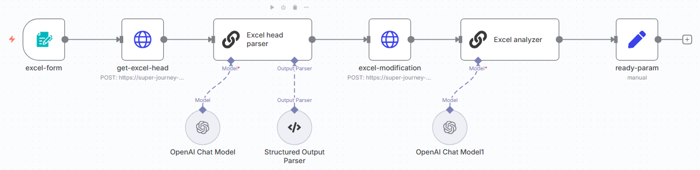

# AX Challenge 최종 보고서

## 1) 개요
- **과제 주제**: 개발지식 챗봇 내 표 및 엑셀 처리 기능 강화
- **핵심 문제**: RAG 과정에서의 토큰/청크 한계와 엑셀 특성으로 질의응답 정확도 저하
- **핵심 접근**: 엑셀 → 전처리 → LLM 보조를 통한 스키마 설계/SQLite DB 생성 → SQL 질의 변환 → SQL 실행 결과 기반으로 자연어 응답 생성

## 2) 문제 정의
- **chunking 방식 RAG 한계**: 
  - **입력 토큰/chunk 사이즈 제한**으로 표 구조의 문맥 손실
  - 테이블 셀 간 관계가 chunk 단위로 분절되어 의미 연결 실패
- **엑셀 처리 이슈**: 
  - 다중 제목줄, 병합 기반 그룹핑, 대규모 행 처리 성능, 결측/단위/형 변환 등 전처리 복잡성
  - 이번 챌린지에서는 **다중 제목줄**, **대규모 행 처리 성능** 해결 목표

## 3) 개선 방안
`n8n` 활용 데이터 파이프라인 구축
  1. 해결하고자 하는 문제의 샘플 데이터 제작
  2. 엑셀 **데이터 분석**
      - LLM을 활용하여 다중 헤더 분석 → 단일 헤더 column 생성
      - LLM을 활용하여 데이터 분석 레포트 생성 → DB 생성 및 데이터 조회 시 시스템 프롬프트로 활용
        - SQLite 테이블 생성 SQL
        - 테이블 및 컬럼 상세 설명
        - 예상 질문과 SQL 쿼리
        - 데이터 활용 가이드

그림 1. 다중 헤더 분석 → 단일 헤더 생성 및 레포트 생성 flow
  3. SQLite **DB 생성**
  4. 사용자 **자연어 질의 → SQL** 변환
  5. SQL 실행 결과 → 자연어 응답

## 4) 효과
- **정확도**: Column 정보와 같은 데이터 문맥이 DB 스키마에 보존되어 헤더 유실로 인한 오답 감소
- **비용/토큰**: NL→SQL 전환으로 대량 표 데이터를 직접 LLM에 투입하지 않아 토큰 비용 절감
- **성능**: SQL 집계/인덱스 활용으로 대용량에서도 안정적 응답 지연 시간 확보
- **운영 편의**: 신규 엑셀 투입 시 자동 전처리·DB 갱신으로 운영부담 완화
- **설명가능성**: 사용된 SQL과 선택된 컬럼/필터를 로그·메타데이터로 제공하여 결과 근거 추적 가능

## 5) 사내망 적용 계획
- Private DevBOT 기능 
- 인프라/정책 문제로 인해 사내 모델 사용이 필수적 -> n8n에 custom 노드로 추가 필요
- 사내 모델의 SQL 생성 정확도 평가 필요 

## 6) 기타
- 차트 생성
  - QuickChart는 외부로 데이터가 전송되는 노드로, 사내에서 사용 불가할 것으로 예상
  - LLM에게 차트를 생성하라는 프롬프트를 입력하여 생성하는 경우, 환경 구성 필요
    - javascript 코드로 차트 생성 시, n8n이 설치된 서버에 chartjs-node-canvas와 같은 패키지 설치 필요
    - Python 코드로 차트 생성 시, n8n이 설치된 서버에 python 설치 필요
  - Challenge에서는 데이터를 입력받으면 정해진 포맷의 차트를 생성하도록 하는 API를 구현하여 활용
    
- 엑셀 파일 내 차트/이미지 처리
  - 차트: 엑셀파일(.xlsx, .xls) 압축해제 시 xml 형식으로 확인 가능. But, LLM 토큰 한계 이슈로 모판 데이터를 DB table로 저장 후 SQL 실행이 낫다고 판단
  - 이미지: 엑셀파일(.xlsx, .xls) 압축해제 시 원본 이미지 파일 획득 가능 -> OCR, Vision-LLM Multimodal model 등 활용 필요

- 이미지 내 표/차트 이해
  - 표: Table Structure Recognition 기술 검토 필요(Microsoft Table Transformer)
  - 차트이해
    - 이미지 -> 데이터 복원: (어떤 시나리오에서 필요할지 검토 필요)
    - 질의응답: ChartQA 데이터셋 리더보드를 확인하여 상위에 위치한 멀티모달 LLM 활용  

- 문서 파일(MS Office, 이메일) 내 이미지, 첨부파일 처리
  - (TO-DO) 

