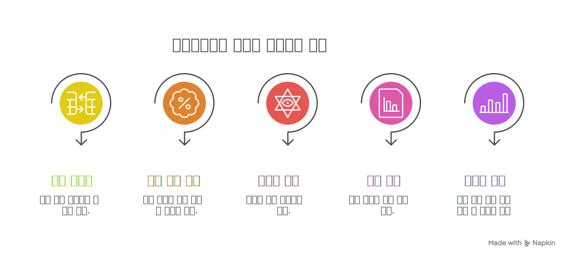
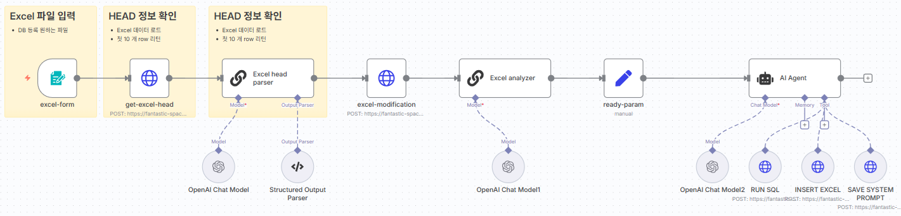
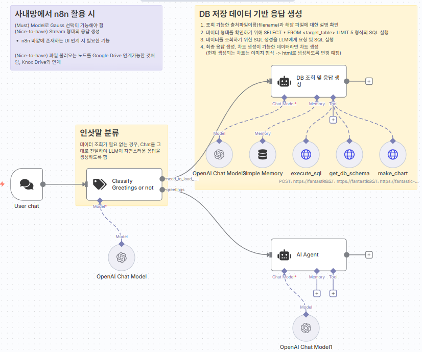

# AX Challenge : DevBOT 엑셀 처리 성능 개선

## 1. 문제

VD AI 기반 지식 검색 챗봇(DevBOT)의 엑셀 질의응답 성능 대폭 개선 필요
- **DevBOT** : 위키 페이지 내 표 정보 또는 엑셀 파일 처리
- **Private DevBOT** : 엑셀 파일 처리

### 부정확하거나 답변이 불가능한 사례
- **엑셀 데이터 전체를 보고 구해야 하는 값** : 최대 매출금액, 최대 매출 상품
- **계산이 필요한 요청** : 25년 3월 대비 25년 4월 매출 금액 차, A 제품의 매출액 25년 합
- **엑셀에 없는 데이터의 예측** : 25년 10월 매출액 예측 (현재 25년 9월)
- **차트 생성** : 24년, 25년 매출액 차트 분석
- **이상치 분석** : 25년 매출 목표 대비 실적 분석 후 이상치 발견

## 2. 원인

- LLM 토큰 길이 한계로 엑셀 파일은 청크로 쪼개어서 저장되어야 함
- 검색 시 하나의 엑셀 파일의 모든 청크 검색이 보장 안됨
- 여러 줄의 제목이나 병합된 그룹핑 데이터의 의미를 정확히 인식 못함
- 사용자 질문과 컬럼명이 일치하지 않는 경우 검색이 안됨

## 3. 개선 방안

n8n을 통한 엑셀 데이터 변환 → 데이터베이스 저장 → LLM 통한 SQL로 답변 생성

### 3.1 엑셀 데이터 등록

- 등록된 엑셀 데이터 분석
- 엑셀 데이터 전처리 : 제목 1줄로 변환, 그룹핑 셀 분해, 제목 변환 등
- LLM을 통한 엑셀 데이터를 데이터베이스(SQLite)에 등록
- LLM이 활용할 시스템 프롬프트 자동 생성: 테이블 스키마, 컬럼 설명, 사용 사례 등

### 3.2 엑셀 기반 질의응답

- 사용자 질문 분석 후 SQL문 생성
- SQL문 실행 후 결과 획득
- 획득된 결과를 바탕으로 답변 생성

## 4. 개선 결과

### 4.1 정량적 개선

#### 엑셀 문서 질의 응답 정확도 향상 (10개 질문지 평가셋 기준)
- **기존 Private DevBOT**: 40% , 60%(사용자 질의에 추가 정보 제공 후)
- **개선**: 100% 달성(GPT-5), 80% (GPT-4.1)

#### 문서 검색 시간 절감
- **기존 수동 엑셀 파일**: 15분 이상 (문서 오픈 후 사람에 의한 검색)
- **개선**: 3분 이내 (채팅 창 열고 답변 생성까지)

### 4.2 정성적 개선

#### 엑셀 처리 범용성 확보
- **기존**: 각 엑셀 파일마다 해당 엑셀만의 특별한한 알고리즘 코드 작성 필요
- **개선**: 동일 알고리즘(n8n)으로 다양한 엑셀 파일 처리 가능

## 5. 추후 계획

### 5.1 적용 계획

- 엑셀 공통 처리를 위한 사내 n8n 서버 인프라 구축 (9월중순 - n8n에 가우스 API 활용 가능 시)
- DevBOT / Private DevBOT: 엑셀, 표처리에 적용 (9월말)
- 공식 오픈 (10월초)

### 5.2 기능 개선

- 엑셀 데이터 기반 다양한 예측 기법 적용
- 다양한 동적 차트 적용
- 피봇 데이터 처리 (매크로나 수식 등)
- 하나의 엑셀 시트에 다수의 표 포함 시 처리

